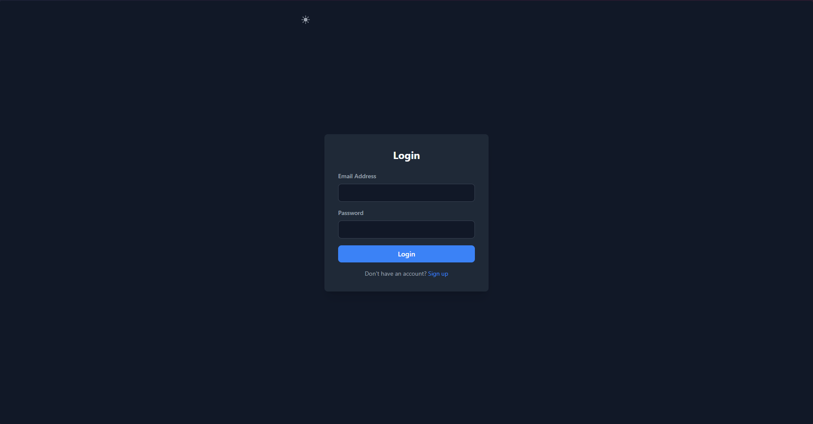
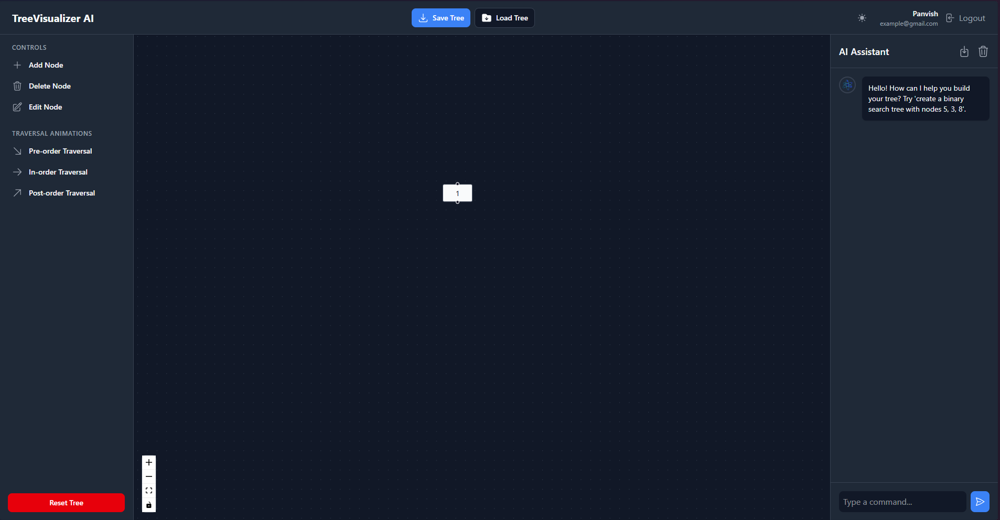
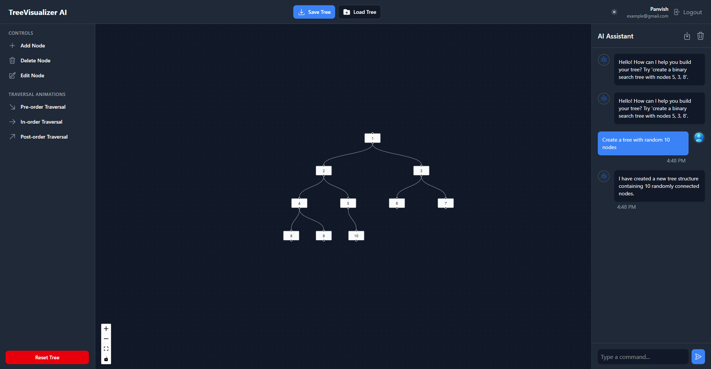
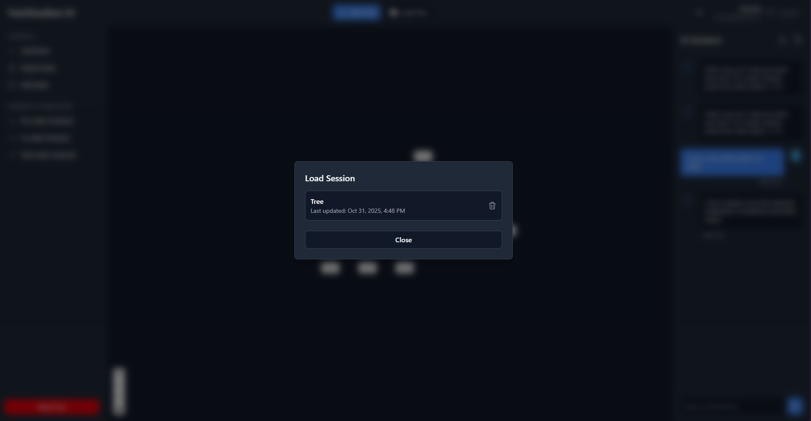

# TreeView AI: An AI-Powered Tree Visualizer

**TreeView AI** is a full-stack web application designed to help users create, visualize, and interact with tree data structures. Users can manipulate the tree through a manual UI or by issuing natural language commands to an AI assistant. The application supports user authentication, session management, and a real-time, interactive chat powered by Google's Gemini AI.

This project fulfills the requirements of a full-stack AI application by integrating a React-based frontend, a Node.js (Express) backend, and a generative AI to manage and operate on a complex data state.

## 🚀 Features

* **Interactive Tree Visualizer:** A drag-and-drop interface using React Flow to build and modify tree structures.
* **AI Chat Assistant:** A chat panel (powered by Gemini AI) that understands and executes commands:
    * **Operations:** "Create a binary search tree with nodes 5, 3, 8"
    * **Analysis:** "What is the height of this tree?"
    * **Chat:** "Hello!"
* **Full User Authentication:** Secure user registration and login using JWT (JSON Web Tokens). Users are auto-logged in on signup.
* **Session Management:** Authenticated users can save their tree structures and chat history to their account and load or delete them later.
* **Traversal Animations:** Visualize Pre-order, In-order, and Post-order tree traversals with real-time node highlighting.
* **Responsive Light/Dark Mode:** A persistent, theme-able UI that works on desktop and mobile.
* **Dockerized Deployment:** The entire application (frontend, backend, DB) is containerized for easy and reliable deployment.

## 🛠️ Tech Stack & Tools Used

This project uses a modern, full-stack JavaScript and AI toolset.

| Layer | Technology |
| :--- | :--- |
| **Frontend** | React, React Flow, Redux Toolkit, Tailwind CSS v4, Axios |
| **Backend** | Node.js, Express.js, Prisma (ORM) |
| **Database** | PostgreSQL |
| **AI** | Google Gemini (via Google AI SDK) |
| **Authentication** | JWT (jsonwebtoken), bcrypt.js |
| **Deployment** | Docker, Docker Compose, AWS EC2 |

## 📂 File Structure

The project is organized into a monorepo structure with a `client` and `server` directory.
```
.
├── client/                  # Frontend React Application (Vite)
│   ├── src/
│   │   ├── assets/          # Static assets (images, icons)
│   │   ├── components/      # Reusable React components
│   │   │   ├── chat/        # ChatPanel and related components
│   │   │   ├── common/      # Shared components (Modals, Protected Route)
│   │   │   ├── layout/      # Structural components (Navbar, LeftSidebar)
│   │   │   └── tree/        # The core TreeVisualizer component
│   │   ├── context/         # React Context (ThemeContext)
│   │   ├── pages/           # Top-level page components
│   │   ├── redux/           # Redux Toolkit state management
│   │   │   ├── slice/       # Individual state slices (auth, chat, tree)
│   │   │   └── store.js     # Redux store configuration
│   │   ├── App.jsx          # Main component with routing
│   │   └── main.jsx         # Application entry point
│   └── Dockerfile           # Builds the client Nginx image
│
├── server/                  # Backend Node.js Application (Express)
│   ├── controllers/         # Business logic for API endpoints
│   ├── lib/                 # Shared library code (e.g., db.js)
│   ├── middleware/          # Express middleware (e.g., auth)
│   ├── prisma/              # Prisma ORM configuration
│   │   ├── migrations/      # Auto-generated SQL migrations
│   │   └── schema.prisma    # Database schema definition
│   ├── routes/              # API route definitions
│   ├── index.js             # Server entry point
│   └── Dockerfile           # Builds the server Node.js image
│
├── .env                     # Environment variables for Docker Compose
├── docker-compose.yml       # Orchestrates all services (client, server, db)
└── README.md                # Project documentation
```

## 📸 Screenshots & Examples

Here are examples of the application in use, demonstrating its functionality and design.

|             Login Page              |       Main App (Dark Mode)        |
|:-----------------------------------:|:---------------------------------:|
|  |  |
|          **AI Operation**           |      **Load Session Modal**       |
|                :---:                |               :---:               |
|  |  |

## ⚙️ Development Process

The application was built in a logical, step-by-step process:

1.  **Frontend Foundation:** The core React application was built first, including all UI components (Navbar, Sidebars, ChatPanel, TreeVisualizer) using Tailwind CSS v4.
2.  **State Management:** Redux Toolkit was implemented to manage all global state, including tree nodes/edges, chat messages, and auth tokens.
3.  **Frontend Interaction:** All UI interactions (Add/Delete/Edit Node, Traversals, Node Dragging, Theme Toggle) were wired up to Redux.
4.  **Backend Server:** A Node.js/Express server was created using ES Modules.
5.  **Database & Docker Setup:** A PostgreSQL database was set up using Docker. Prisma was initialized to connect the server to the database and manage the schema.
6.  **Authentication:** Secure `/api/auth/signup` and `/api/auth/login` endpoints were built using JWT and bcrypt. The signup route was configured to auto-login the user.
7.  **Session API:** Protected CRUD endpoints (`/api/sessions`) were created to allow authenticated users to save, load, and delete their sessions.
8.  **AI Integration:** An AI controller (`/api/chat`) was built. This route formats a detailed system prompt and calls the Gemini AI to parse user commands and return structured JSON.
9.  **Dockerization:** `Dockerfile`s were written for the `client` (Nginx) and `server` (Node). The `docker-compose.yml` file was updated to orchestrate all three services.
10. **Deployment:** The entire Docker setup was deployed to an AWS EC2 instance, including setting up security groups, installing Docker, and running the containers.

## 💡 Challenges Faced and Solutions Implemented

This section details key challenges encountered during development and the solutions that were implemented.

| Challenge | Solution |
| :--- | :--- |
| **AI sending un-labeled nodes** | The AI was sending node data (e.g., `label: "50"`) in an inconsistent format. The `TreeVisualizer` component was made more robust to check multiple properties (`node.data.label`, `node.label`) to find and render the label correctly. |
| **AI response breaking JSON parse** | The Gemini AI would often wrap its JSON response in a Markdown code block (e.g., \`\`\`json ... \`\`\`), causing a `SyntaxError`. A helper function, `extractJson()`, was written on the backend to reliably find and extract the JSON from the raw text response, making parsing robust. |
| **Gemini 404 Errors** | The initial model names (`gemini-1.5-flash`, `gemini-pro`) were not found. This was resolved by using the universally available `gemini-1.0-pro` model and removing the `responseMimeType: "application/json"` config, which was not supported by that model. |
| **Docker `server` container crash** | The `server` container would start faster than the `postgres-db` container, and Prisma would crash when it couldn't find the database. This was solved by adding a `healthcheck` to the `postgres-db` service in `docker-compose.yml` and making the `server` `depends_on` the `service_healthy` condition. |
| **CORS errors after deployment** | The deployed frontend (`http://<server-ip>`) was blocked from calling the backend (`http://localhost:5000`). This was a build-time error. The React code was updated to call the server's public IP (`http://<server-ip>:5000`) and the `client` image was rebuilt. |
| **Docker `buildx` Error** | The `docker-compose build` command failed on the server, requiring a `buildx` plugin. This was bypassed by setting the `DOCKER_BUILDKIT=0` environment variable, forcing Docker to use the reliable legacy builder. |

## 🚀 Deployment Steps and Requirements

This application is designed to be deployed as a set of Docker containers.

### 1. Requirements

* An active **AWS Account**.
* An **EC2 Instance** (e.g., `t2.micro`) running Amazon Linux 2023.
* Docker and Docker Compose installed on the EC2 instance.
* A generated **`.pem` key file** to access the server.
* A **Google Gemini API Key**.

### 2. Security Group Configuration

Your EC2 instance's Security Group must allow inbound traffic on:

* **Port 22 (SSH):** From "My IP" (for admin access).
* **Port 80 (HTTP):** From "Anywhere" (for the frontend).
* **Port 5000 (Custom TCP):** From "Anywhere" (for the backend API).

### 3. Deployment Steps

1.  **Update API Calls:** Before zipping, go into your `client/src` folder and change all `axios` calls from `http://localhost:5000` to `http://<YOUR_SERVER_IP>:5000`.

2.  **Copy Files to Server:** Zip the project and use `scp` to copy it to your EC2 instance.
    ```bash
    # Run from your local machine
    scp -i "your-key.pem" "project.zip" ec2-user@your-server-ip:~/
    ```

3.  **Connect to Server:**
    ```bash
    ssh -i "your-key.pem" ec2-user@your-server-ip
    ```

4.  **Install Tools:**
    ```bash
    # Install Docker, Docker Compose, and unzip
    sudo dnf install docker docker-compose unzip -y
    sudo service docker start
    sudo usermod -a -G docker ec2-user
    # Log out and log back in for permissions to take effect
    exit
    ssh -i "your-key.pem" ec2-user@your-server-ip
    ```

5.  **Prepare Project:**
    ```bash
    unzip project.zip
    cd your-project-folder
    ```

6.  **Create Environment File:** Create the `.env` file for `docker-compose`.
    ```bash
    nano .env
    ```
    Paste your production secrets into this file:
    ```env
    POSTGRES_USER=myuser
    POSTGRES_PASSWORD=mypassword
    POSTGRES_DB=treeview_db
    JWT_SECRET=YOUR_NEW_STRONG_PRODUCTION_SECRET
    GEMINI_API_KEY=YOUR_REAL_GEMINI_API_KEY
    ```

7.  **Build and Run:**
    ```bash
    # Use DOCKER_BUILDKIT=0 to avoid buildx errors
    DOCKER_BUILDKIT=0 docker-compose up --build -d
    ```

8.  **Run Database Migration:**
    ```bash
    docker-compose exec server npx prisma migrate deploy
    ```

The application is now live at your server's public IP address.

## 🗃️ Database Initialization

As per the project requirements, here is the database initialization process.

This project uses **Prisma Migrate** to manage the database schema, which is a modern alternative to writing raw SQL scripts.

* **SQL Scripts:** The SQL scripts required to create all tables, relations, and indexes are **auto-generated by Prisma**. They are located in the `server/prisma/migrations` folder.
* **Initialization:** The database is automatically initialized and all tables are created by running a single command after deployment:
    ```bash
    docker-compose exec server npx prisma migrate deploy
    ```
This command reads the migration history and applies all necessary SQL scripts to the database, ensuring the schema is perfectly in sync with the application code. No manual SQL scripts are required to create or insert initial data.